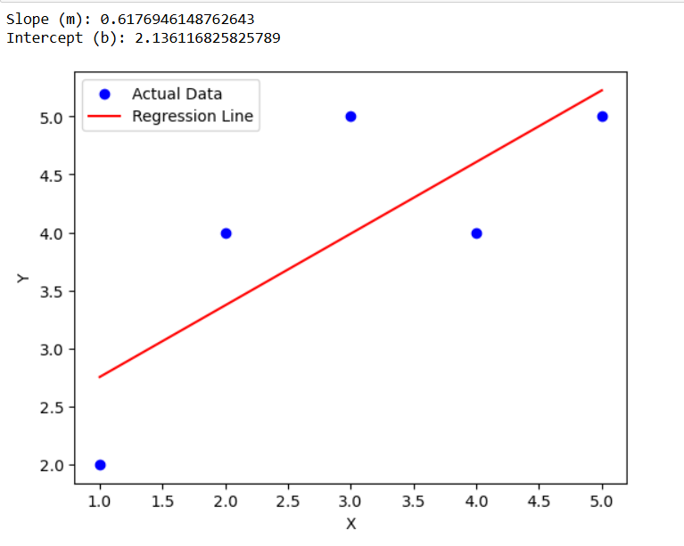

# Implementation-of-Linear-Regression-Using-Gradient-Descent

## AIM:
To write a program to predict the profit of a city using the linear regression model with gradient descent.

## Equipments Required:
1. Hardware – PCs
2. Anaconda – Python 3.7 Installation / Jupyter notebook

## Algorithm
1. Initialize parameters (slope m and intercept b) with random values.
2. Calculate predicted values using the linear equation y=mx+b.
3. Compute the error and update m and b using Gradient Descent to minimize the cost function.
4. Repeat the process until the error is minimized and the model converges.

## Program:
```
/*
Program to implement the linear regression using gradient descent.
Developed by: Darshini N
RegisterNumber: 212225230200  
Ex3: import numpy as np
import matplotlib.pyplot as plt

# Sample dataset
x = np.array([1, 2, 3, 4, 5])
y = np.array([2, 4, 5, 4, 5])

# Initialize parameters
m = 0  # slope
b = 0  # intercept

learning_rate = 0.01
epochs = 1000
n = len(x)

# Gradient Descent
for i in range(epochs):
    
    # Predicted values
    y_pred = m * x + b
    
    # Calculate gradients
    dm = (-2/n) * np.sum(x * (y - y_pred))
    db = (-2/n) * np.sum(y - y_pred)
    
    # Update parameters
    m = m - learning_rate * dm
    b = b - learning_rate * db

print("Slope (m):", m)
print("Intercept (b):", b)

# Plot results
y_pred = m * x + b

plt.scatter(x, y, color='blue', label="Actual Data")
plt.plot(x, y_pred, color='red', label="Regression Line")
plt.xlabel("X")
plt.ylabel("Y")
plt.legend()
plt.show()
*/
```

## Output:
  

## Result:
Thus the program to implement the linear regression using gradient descent is written and verified using python programming.
